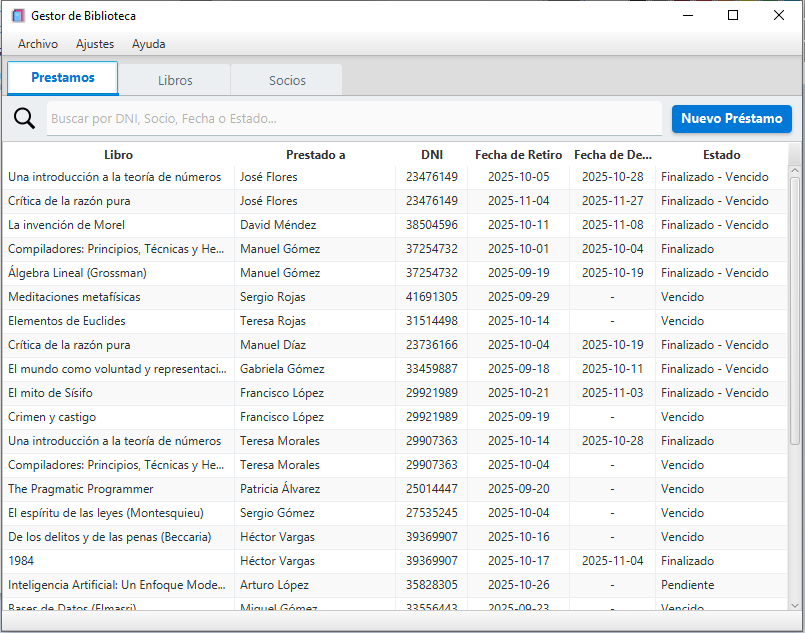
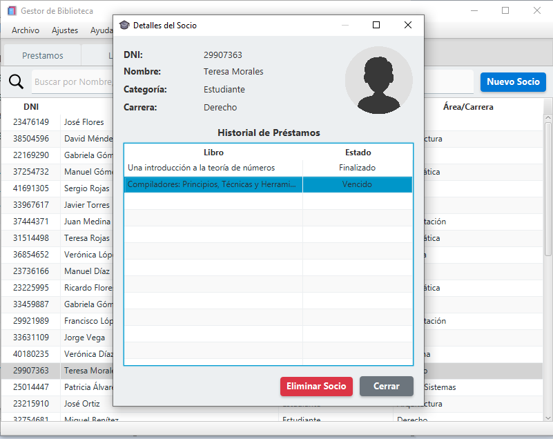
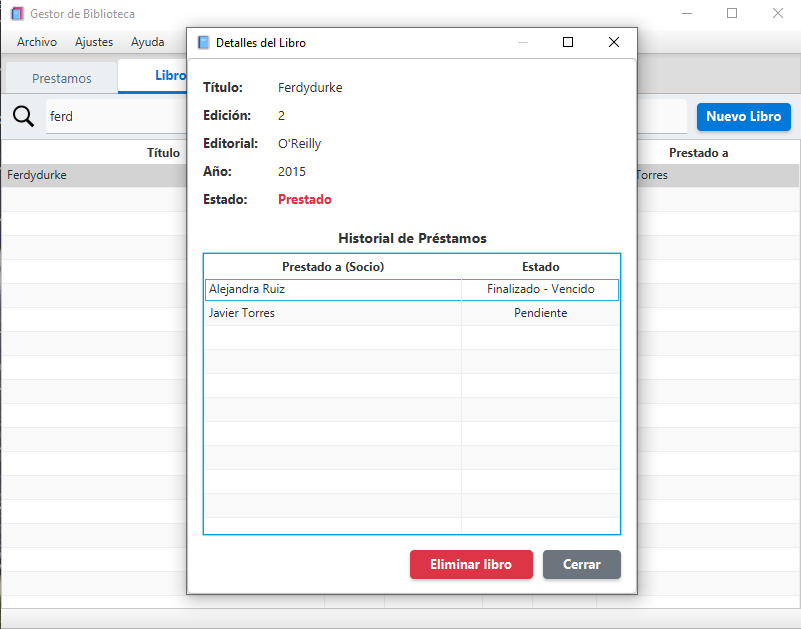
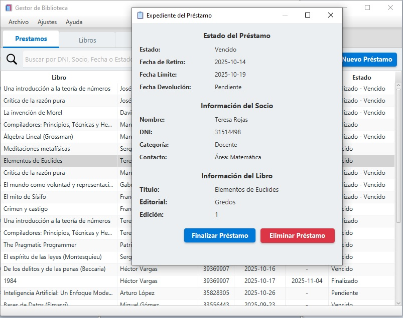

# java-gestion-biblioteca
=======
# 📚 Gestor de Biblioteca

Una aplicación de escritorio moderna, construida con JavaFX y Maven, para la gestión integral de bibliotecas.

---

## ✨ Características Principales

Implementa una experiencia de usuario fluida:

* **Interfaz Gráfica Moderna:** UI limpia e intuitiva construida con JavaFX (FXML) y estilizada con un tema CSS inspirado en Material Design.
* **Persistencia Robusta:** Los datos de la aplicación (libros, socios, préstamos) se guardan automáticamente al cerrar y se cargan al iniciar. Utiliza la serialización nativa de Java (`java.io.Serializable`) para manejar de forma segura las complejas relaciones circulares del modelo de datos.
* **Gestión de Datos:** Los datos de la aplicación (`biblioteca.dat`) se almacenan de forma segura en la carpeta `%APPDATA%\GestorDeBiblioteca` del usuario.
* **Arquitectura Reactiva:** Las tablas se actualizan automáticamente, permitiendo:
    * **Filtros en Tiempo Real:** Barras de búsqueda que filtran las tablas instantáneamente con cada tecla presionada.
    * **Búsqueda Inteligente:** El filtrado es insensible a mayúsculas y acentos (ej. "García" encuentra "garcia").
    * **Ordenamiento de Columnas:** Funcionalidad completa de ordenamiento por clic en la cabecera que funciona *en conjunto* con los filtros.

### Módulos Detallados

* **Gestión de Socios:**
    * Creación de `Socios` (Estudiantes y Docentes) a través de un formulario emergente dinámico que cambia sus campos según la categoría seleccionada.
    * Doble clic en un socio para abrir un popup de "Detalles" con su información, foto de perfil (placeholder) y una tabla con su **historial de préstamos**.
 
      
      

* **Gestión de Libros:**
    * Creación y eliminación de `Libros`.
    * Doble clic en un libro para abrir un popup de "Detalles" que incluye su estado (Disponible/Prestado) y una tabla de su **historial de préstamos**.
 
      

* **Gestión de Préstamos:**
    * Formulario de "Nuevo Préstamo" para buscar libros y socios.
    * Selector de fecha para el día del préstamo.
    * Doble clic en un préstamo para abrir un "Expediente" detallado que muestra el estado, fechas clave, e información del socio y del libro involucrados, permitiendo **Finalizar** o **Eliminar** el préstamo.
 
    * 
 
      
* **Reportes y Ajustes:**
    * Generador de reportes dinámicos (Socios, Libros, Docentes) accesibles desde el menú principal.
    * Panel de ajustes para modificar el nombre de la biblioteca, que se refleja en tiempo real en el título de la ventana y en los reportes.

---

## 🛠️ Stack Tecnológico

* **Lenguaje:** Java 21
* **Framework de UI:** JavaFX 21 (FXML y CSS)
* **Componentes Adicionales:** ControlsFX 11.1.2 (para `SearchableComboBox`)
* **Persistencia:** Serialización Nativa de Java (`java.io.Serializable`, `ObjectOutputStream`)
* **Build:** Apache Maven
* **Distribución:** `io.github.fvarrui:javapackager` (Plugin de Maven) para generar un instalador `.exe` nativo de Windows (vía Inno Setup) que empaqueta el JRE.

---

## 🚀 Instalación y Uso (Para Usuarios)

No se requiere tener Java instalado. El instalador `.exe` incluye todo lo necesario.

1.  Ve a la sección **"Releases"** de este repositorio de GitHub.
2.  Descarga el archivo `Gestor-de-Biblioteca-1.0.0.exe` de la última versión.
3.  Ejecuta el instalador. Te guiará en el proceso y te preguntará si deseas crear un acceso directo en el escritorio.
4.  ¡Listo! Puedes ejecutar la aplicación desde el Menú Inicio.

---

## 👥 Autores

Este proyecto fue desarrollado por:

* Fernández, Pablo
* Kruzolek, Lucas
* Marquez, Marcos Abel
* Rojas, Marcos Agustín
* Sanchez Cueba, Tobías
* Santoro Sandoval, Lionel
